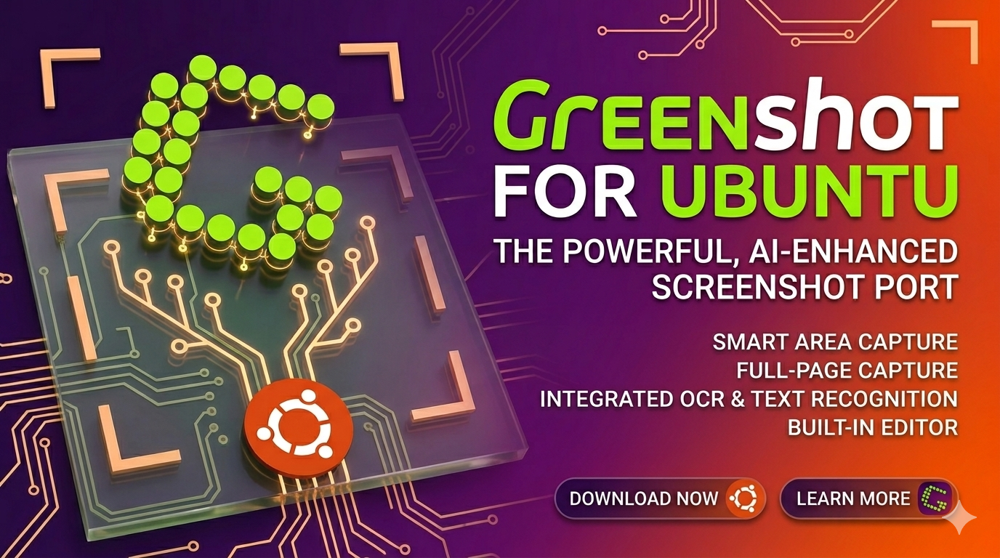

# Greenshot for Ubuntu/Linux

A port of Greenshot screenshot tool from Windows/.NET 4.8/WinForms to Ubuntu/.NET 8/Avalonia.

## Architecture

### Original (Windows)
- .NET Framework 4.8
- WinForms (System.Windows.Forms)
- Win32 P/Invoke via Dapplo.Windows.* libraries
- GDI+ screen capture (BitBlt)
- DWM/Aero window capture
- Dapplo.Ini config system (INI files)
- Windows Registry access
- UWP Toast notifications
- COM/OLE clipboard
- log4net logging

### Ported (Ubuntu/Linux)
- .NET 8
- Avalonia 11 (XAML-based, GTK backend)
- X11 P/Invoke (libX11.so.6) for screen capture and hotkeys
- SixLabors.ImageSharp for image processing
- SkiaSharp (via Avalonia.Skia) for editor rendering
- JSON config stored in `~/.config/greenshot/`
- D-Bus notifications via `notify-send`
- X11 clipboard via `xclip`/`xsel`/`wl-clipboard`
- Microsoft.Extensions.Logging

## Project Structure

```
src/
├── Greenshot.sln                 # Solution file
├── Directory.Build.props         # Global build settings (targets net8.0)
├── Greenshot.Base/               # Platform-agnostic core
│   ├── Core/                     # ICapture, ICoreConfiguration, enums
│   ├── Interfaces/               # IDestination, IGreenshotPlugin
│   └── Platform/                 # IScreenCaptureProvider, IHotkeyProvider
├── Greenshot.Linux/              # Linux platform implementations
│   ├── X11/X11Api.cs             # X11 P/Invoke declarations (libX11.so.6)
│   ├── X11/X11ScreenCapture.cs  # Screen capture via XGetImage
│   ├── X11/X11HotkeyProvider.cs # Global hotkeys via XGrabKey
│   └── DBus/DbusNotificationService.cs  # notify-send wrapper
├── Greenshot.Editor/             # Avalonia image editor
│   ├── Drawing/Surface.cs        # Avalonia Canvas + SkiaSharp drawing
│   ├── Drawing/*.cs              # Drawing containers (Rect, Ellipse, Arrow, etc.)
│   └── Views/EditorWindow.axaml  # Editor UI
├── Greenshot/                    # Main application
│   ├── App.axaml                 # Avalonia application root
│   ├── Views/CaptureOverlayWindow.axaml  # Fullscreen capture overlay
│   ├── Views/SettingsWindow.axaml
│   ├── Helpers/CaptureHelper.cs  # Capture orchestration
│   ├── Destinations/             # File, Clipboard, Editor destinations
│   └── ViewModels/MainViewModel.cs # Tray icon, hotkey coordination
├── Greenshot.Plugin.Imgur/       # Imgur upload plugin
└── Greenshot.Plugin.Dropbox/     # Dropbox upload plugin
```

## Features Ported

### Screen Capture
- [x] Full screen capture (all monitors via X11 XGetImage)
- [x] Region capture (interactive overlay with magnifier)
- [x] Last region repeat
- [x] Window capture (interactive selection)
- [x] Active window capture (X11 _NET_ACTIVE_WINDOW to come)
- [x] Wayland capture (portal API — XWayland fallback works)

### Image Editor
- [x] Rectangle annotation
- [x] Ellipse annotation
- [x] Arrow annotation
- [x] Text annotation
- [x] Freehand drawing
- [x] Highlight overlay
- [x] Obfuscate/blur region
- [x] Undo/Redo
- [x] Save (PNG, JPEG, BMP, TIFF)
- [x] Copy to clipboard
- [ ] Step labels
- [ ] Image effects (blur, brightness, contrast)

### System Integration
- [x] System tray (Avalonia TrayIcon → GTK StatusIcon)
- [x] Global hotkeys (X11 XGrabKey; doesn't work on pure Wayland without XWayland)
- [x] Desktop notifications (notify-send)
- [x] Clipboard copy (xclip/xsel/wl-clipboard)
- [ ] Wayland global hotkeys (portal API TBD)

### Configuration
- [x] JSON config in `~/.config/greenshot/greenshot.json`
- [x] Settings UI


## Requirements

### Runtime
- Ubuntu 22.04+ (or other modern Linux)
- `libX11.so.6` (X11 display server or XWayland)
- `notify-send` (from `libnotify-bin`) for notifications
- `xclip` or `xsel` for clipboard, or `wl-clipboard` for Wayland

### Build
- .NET 8 SDK

```bash
# Install dependencies
sudo apt install libnotify-bin xclip

# Build
./build.sh

# Run
./publish/Greenshot
```

## Key Porting Decisions

| Aspect | Windows Original | Linux Port |
|--------|-----------------|------------|
| UI Framework | WinForms | Avalonia 11 |
| Screen Capture | GDI BitBlt / DWM | X11 XGetImage |
| Global Hotkeys | SetWindowsHookEx | X11 XGrabKey |
| Clipboard | Win32 OLE Clipboard | xclip/wl-clipboard |
| System Tray | NotifyIcon | Avalonia TrayIcon |
| Notifications | UWP Toast | notify-send |
| Config | Dapplo.Ini + %APPDATA% | JSON + ~/.config |
| Image Processing | System.Drawing (GDI+) | SixLabors.ImageSharp |
| Editor Rendering | WinForms Control + GDI+ | Avalonia + SkiaSharp |

## Excluded (Windows-only features)
- Microsoft Office integration (Word, Excel, PowerPoint, Outlook, OneNote)
- Confluence plugin (depends on WPF XAML forms)
- OCR features

### Upload Plugins
- [] Imgur (anonymous upload)
- [] Dropbox (requires access token)

## License
MIT
